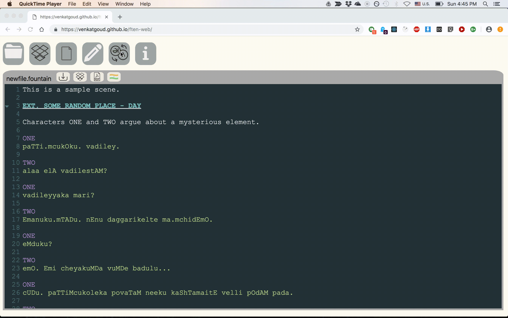

    
  
  
  
  Check the application [here](https://venkatgoud.github.io/ften-web)
  
  <h3> What is this? </h3>
  
This tool is for screenwriters, mostly for Indian screenwriters. It helps in two ways. 

  <ul> 
    <li>Some Indian screenplays are maintained in two forms. One, a transliteration form 
      so that they can be read by people who cannot read the native script. Two, a native version. Writing a screenplay itself is an arduous task in itself and maintaining two versions is a headache one wants to avoid. With this application, one can 'convert' from one form to another easily.
    </li>
    <li>
      The screenplay format -- at least for production -- used in India is also different than the Hollywood format. In the Indian version, the page is split in half vertically. The screen action is on the left and dialogs are on the right. The task of maintaining two versions typically befalls on an unpaid assistant director! This application helps generate an Indian format as needed.
    </li>
  </ul>
  
 You can just have one script and generate the format you want and whenever you want.

  
 This is a client-side only app means your screenplay is never sent to any server.

  <h3> Features </h3>
    <ul>
      <li>Load a screenplay from your Dropbox or from your computer.</li>
      <li>Transliterate. Click on the 'Trans' icon on the top. It will open a dual editor where by clicking on the arrow icon, you can transliterate.</li>
      <li>Download to your computer or save it to your dropbox</li>
      <li>Generate PDF in Indian movie industry format</li>
    </ul>
  <h3> Known issues </h3>
  <ul>
    <li>Only converts the dialog portion of the script to native and vice-versa. Leaves action and character names as is. </li>
    <li>Certain often used English words are not 'converted'. They are kept as is. An internal dictionary is used for that.</li>
    <li>Only supports <a href="http://fountain.io">Fountain</a> format which is an open format. Most screenwriting software has an option for fountain.</li>
    <li>BUG: Indian PDF format in native script doesn't work yet. Waiting on dependent component to support the woff fonts. Workaround: Use command line tools from <a href="https://github.com/venkatgoud/fountain-utils">here</a></li>
    <li>Issue: Saving native script directly into Dropbox fails. Workaround: You can always use the download option to download into your Dropbox folder to sync it.</li>
    <li>BUG: The PDF for Hollywood format doesn't have correct margins. Don't use it!</li>
  <li>Issues in formatting the title page</li> 
      <li>Transliteration is adding blanklines in the beginning and end.</li>
  </ul>   
  <h3> Credits </h3>
  <a href="https://github.com/mattdaly/Fountain.js">https://github.com/mattdaly/Fountain.js</a>  
  <a href="https://github.com/afterwriting">https://github.com/afterwriting</a>  
  <a href="https://www.npmjs.com/package/sanscript">https://www.npmjs.com/package/sanscript</a>  
  Icon made by <a href="https://www.flaticon.com/authors/vignesh-oviyan">Freepik,vignesh</a> from www.flaticon.com 

